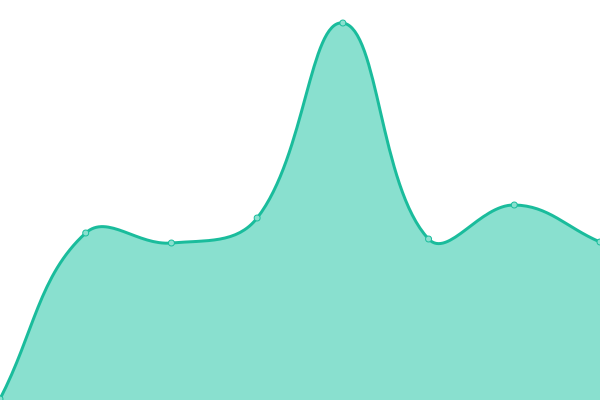

# [📈 Live Status](https://status.praglowski.com): <!--live status--> **🟧 Partial outage**

This repository contains the open-source uptime monitor and status page for [Mirosław Pragłowski](praglowski.com), powered by [Upptime](https://github.com/upptime/upptime).

With [Upptime](https://upptime.js.org), you can get your own unlimited and free uptime monitor and status page, powered entirely by a GitHub repository. We use [Issues](https://github.com/mpraglowski/status.praglowski.com/issues) as incident reports, [Actions](https://github.com/mpraglowski/status.praglowski.com/actions) as uptime monitors, and [Pages](https://status.praglowski.com) for the status page.

<!--start: status pages-->
<!-- This summary is generated by Upptime (https://github.com/upptime/upptime) -->
<!-- Do not edit this manually, your changes will be overwritten -->
<!-- prettier-ignore -->
| URL | Status | History | Response Time | Uptime |
| --- | ------ | ------- | ------------- | ------ |
|  [praglowski.com](https://praglowski.com) | 🟩 Up | [praglowski-com.yml](https://github.com/mpraglowski/status.praglowski.com/commits/HEAD/history/praglowski-com.yml) | 

 287ms
     
 | 

<a href="https://status.praglowski.com/history/praglowski-com">100.00%</a>
    

|  [praglowska.com](https://praglowska.com) | 🟩 Up | [praglowska-com.yml](https://github.com/mpraglowski/status.praglowski.com/commits/HEAD/history/praglowska-com.yml) | 

 316ms
     
 | 

<a href="https://status.praglowski.com/history/praglowska-com">100.00%</a>
    

|  [tomek.praglowski.com](https://tomek.praglowski.com) | 🟥 Down | [tomek-praglowski-com.yml](https://github.com/mpraglowski/status.praglowski.com/commits/HEAD/history/tomek-praglowski-com.yml) | 

 2647ms
     
 | 

<a href="https://status.praglowski.com/history/tomek-praglowski-com">0.00%</a>
    

|  [slub.praglowski.com](https://slub.praglowski.com) | 🟩 Up | [slub-praglowski-com.yml](https://github.com/mpraglowski/status.praglowski.com/commits/HEAD/history/slub-praglowski-com.yml) | 

 118ms
     
 | 

<a href="https://status.praglowski.com/history/slub-praglowski-com">100.00%</a>
    

|  [talks.praglowski.com](https://talks.praglowski.com) | 🟩 Up | [talks-praglowski-com.yml](https://github.com/mpraglowski/status.praglowski.com/commits/HEAD/history/talks-praglowski-com.yml) | 

 141ms
     
 | 

<a href="https://status.praglowski.com/history/talks-praglowski-com">100.00%</a>
    

|  [europebycar.info](https://europebycar.info) | 🟩 Up | [europebycar-info.yml](https://github.com/mpraglowski/status.praglowski.com/commits/HEAD/history/europebycar-info.yml) | 

 256ms
     
 | 

<a href="https://status.praglowski.com/history/europebycar-info">100.00%</a>
    

<!--end: status pages-->

[**Visit our status website →**](https://status.praglowski.com)

## 📄 License

- Powered by: [Upptime](https://github.com/upptime/upptime)
- Code: [MIT](./LICENSE) © [Mirosław Pragłowski](praglowski.com)
- Data in the `./history` directory: [Open Database License](https://opendatacommons.org/licenses/odbl/1-0/)
